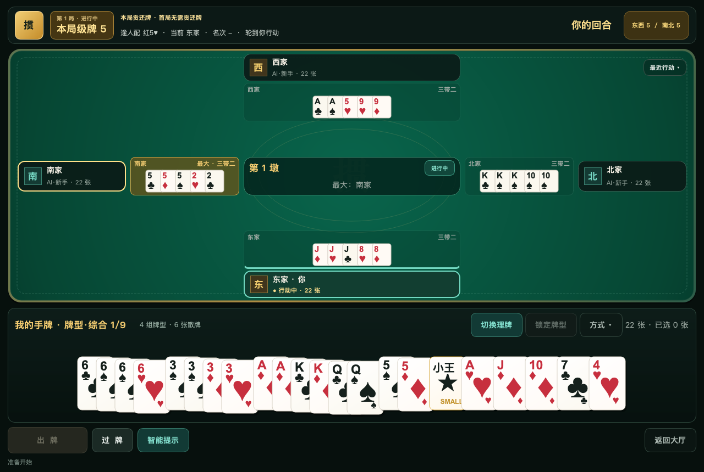
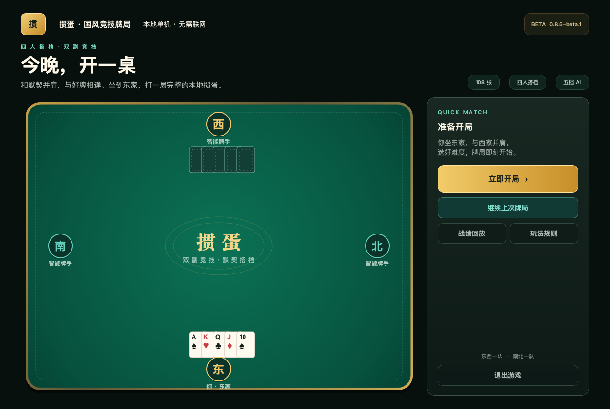
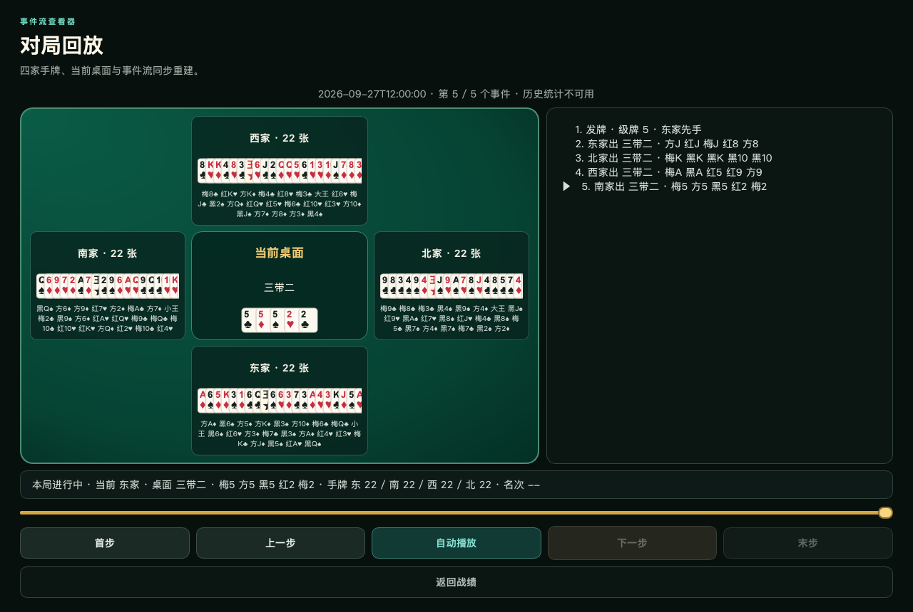
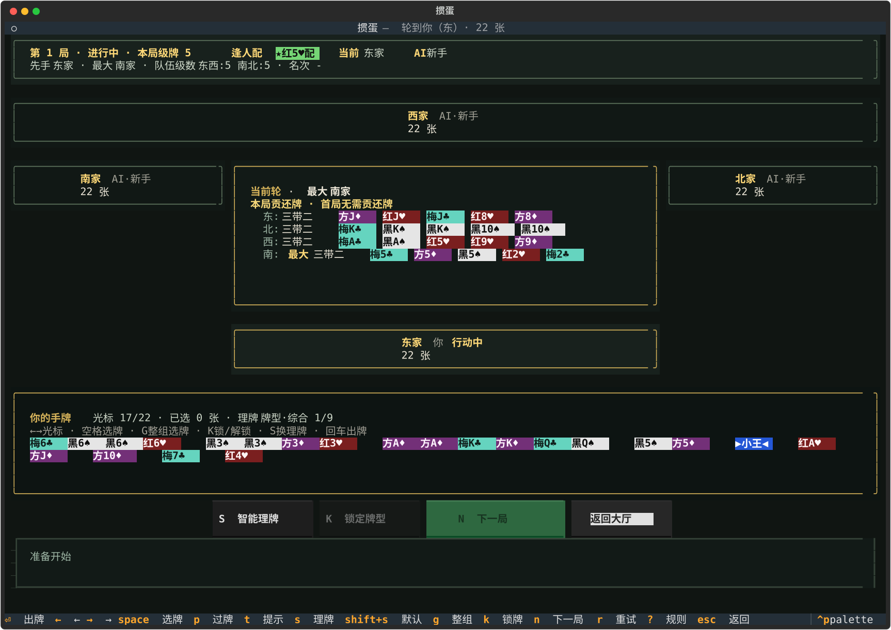

# 掼蛋（Guandan）

**今晚，开一桌。** 一款开源、离线的单机掼蛋游戏：你与 AI 队友搭档，对阵另外两名 AI，从 2 一路打到过 A。支持原生桌面 GUI 和终端 TUI，无需注册账号。

**当前版本：[v0.8.6-beta.1 公测版](https://github.com/itsVicOC/guandan/releases/tag/v0.8.6-beta.1)** · Windows / macOS / Linux · Python 3.10+ · MIT

[下载安装](#下载安装) · [游戏画面](#游戏画面) · [开始第一局](#开始第一局) · [操作速查](#操作速查) · [完整规则](docs/rules.md) · [更新日志](CHANGELOG.md)



自己在下方、队友在上方，对手分列左右；出牌、过牌和当前最大牌一目了然。底部提供智能理牌、提示和锁定牌组，鼠标与键盘都能操作。

## 游戏画面

以下画面由 **v0.8.5-beta.1 实际程序**生成。牌局和回放使用同一固定种子的合法对局，未使用概念图或手工拼牌；字体与窗口装饰可能因系统不同而略有差异。

### 桌面大厅

从大厅开始新局、继续上次进度，或进入历史战绩与玩法规则。



<details>
<summary>展开查看对局回放与终端界面</summary>

### 对局回放

按事件逐步查看四家手牌与桌面变化，支持上一步、下一步、自动播放和进度拖动。四家手牌在回放中公开；正常对局不会向玩家展示对手暗牌。



### 终端 TUI

在终端里也能完成开局、出牌、理牌、贡还牌、续局和回放，共用同一套规则与本地数据。



</details>

## 特性

- 🎴 完整掼蛋对局：2 副牌 108 张、4 人固定搭档、级牌、4-10 张炸弹、同花顺、进贡/还贡、报牌、逢人配、抗贡、过 A；具体口径见[规则文档](docs/rules.md)
- 🤖 5 档 AI 难度；手牌规划、公开记牌、队友配合逐档增强，高档 AI 使用隐藏世界采样与限时搜索
- 🔁 历史战绩 / 自动保存 / 断点续局恢复 / GUI 与 TUI 牌桌式回放，跨局保留同一比赛标识
- 🖥️ 桌面 GUI（`PySide6`）：现代四人牌桌、单排重叠手牌、缩略牌墩、动态座位状态，以及大厅 / 难度 / 存档 / 历史 / 回放 / 规则完整流程
- 💻 终端 TUI（`textual`），首页 / 难度页 / 牌局页已统一深色牌桌风格，macOS / Linux 主流终端兼容
- 🃏 GUI / TUI 智能理牌：优先保留炸弹、同花顺，以紧叠牌组展示整手牌；支持点数、花色、张数等视图、整组选牌，以及手工锁定 / 解锁牌型
- 👥 你的手牌出完后可查看对家剩余手牌；下一局发牌时自动恢复隐藏
- 🧪 公测版已完成规则回归、AI 候选策略、AI 对战基准、GUI session、TUI 主流程与断点续局的自动化验证
- 🔒 GUI / TUI 并行运行时使用跨进程锁与存档修订号保护进度；冲突会保留双方数据，可从续局页恢复副本

## 下载安装

### 直接运行桌面包

从 [v0.8.6-beta.1 下载页](https://github.com/itsVicOC/guandan/releases/tag/v0.8.6-beta.1) 的 **Assets** 中选择对应平台压缩包。桌面包已包含 Python、PySide6 和运行依赖，解压后即可运行：

| 系统 | 下载文件 | 启动方式 |
| --- | --- | --- |
| Windows x64 | `Guandan-v0.8.6-beta.1-windows-x64.zip` | 解压整个文件夹，运行 `Guandan/Guandan.exe` |
| macOS Apple Silicon（M 系列） | `Guandan-v0.8.6-beta.1-macos-arm64.zip` | 解压后打开 `Guandan.app` |
| macOS Intel | `Guandan-v0.8.6-beta.1-macos-x64.zip` | 解压后打开 `Guandan.app` |
| Linux x64 | `Guandan-v0.8.6-beta.1-linux-x64.tar.gz` | 解压后运行 `./Guandan/Guandan` |

Linux 若执行位丢失，可先执行 `chmod +x Guandan/Guandan`。发布页的 `SHA256SUMS.txt` 可用于校验下载文件。`Source code` 是源码归档；直接游玩请选择上表中的桌面包。

当前测试包尚未进行商业代码签名。Windows SmartScreen 或 macOS Gatekeeper 首次启动时可能要求用户确认；macOS 可在 Finder 中右键应用并选择“打开”。

### 从源码运行

需要 Python 3.10+，推荐使用 `uv`。在仓库目录执行：

```bash
git clone https://github.com/itsVicOC/guandan.git
cd guandan
git checkout v0.8.6-beta.1

# 按锁文件安装开发工具、终端界面和桌面界面
uv sync --locked --extra dev --extra gui
uv run --no-sync guandan-gui
```

仅使用终端界面时可省略 `--extra gui`，启动命令改为 `uv run --no-sync guandan`。

也可以使用 pip，在克隆后的仓库目录执行：

```bash
python3 -m venv .venv
source .venv/bin/activate
# Windows PowerShell 使用：.venv\Scripts\Activate.ps1
pip install -e ".[dev,gui]"
guandan-gui
```

激活虚拟环境后，三个入口分别为：

| 入口 | 命令 | 用途 |
| --- | --- | --- |
| 桌面 GUI | `guandan-gui` | 鼠标与键盘操作的完整桌面游戏 |
| 终端 TUI | `guandan` | 终端牌桌，支持完整比赛、存档与回放 |
| 文本 CLI | `guandan-cli` | 轻量命令行单局体验与调试 |

## 开始第一局

1. 启动游戏，在大厅点击「立即开局」，选择 AI 难度；第一次游玩可从「新手」开始。
2. 你坐东家，与西家组队。查看顶部的本局级牌，红心级牌是「逢人配」。
3. 轮到你时，点击手牌选牌，再点击「出牌」或按 `Enter`；可以按 `T` 循环查看合法出牌提示，按 `P` 过牌。
4. 每局结束后按 `N` 进入下一局，按界面提示完成进贡或还贡，继续升级直到成功过 A。
5. 中途返回大厅或关闭窗口会保存进度；下次选择「继续上次牌局」。已完成的小局可在历史战绩中回放。

## 操作速查

| 操作 | 桌面 GUI | 终端 TUI |
| --- | --- | --- |
| 选择 / 取消手牌 | 单击；按住横向拖动可连续选择 | 方向键移动，`Space` 选择 |
| 出牌 / 过牌 | `Enter` / `P`，或点击按钮 | `Enter` / `P` |
| 循环出牌提示 | `T` | `T` |
| 切换智能理牌 | `S` | `S` |
| 理牌方式 | `Shift+S` 打开方式菜单 | `Shift+S` 恢复默认顺序 |
| 选择整个牌组 | 双击组内手牌 | `G` 选中光标所在组 |
| 锁定 / 解锁牌型 | `K` | `K` |
| 取消已选手牌 | `Backspace` 或「取消选择」清空 | 移动光标并用 `Space` 逐张取消 |
| 下一局 / 返回 | `N` / `Esc` | `N` / `Esc` |
| 回看上一墩 / 异常重试 | `R` 回看上一墩；点击「重试」重试失败任务 | `R` 重试失败任务 |

GUI 窗口最小为 1080 × 760；TUI 建议将终端放大至约 140 列 × 48 行，并使用支持中文与扑克牌花色的字体。

## 五档 AI

| 难度 | 特点 |
| --- | --- |
| 新手 | 基础理牌、低成本跟牌，保留炸弹 |
| 进阶 | 规划剩余牌组，减少出完手牌所需手数 |
| 高手 | 利用公开记牌信息，结合队友位置让牌、接风与拦截 |
| 职业 | 全局面隐藏牌采样搜索，常规 / 关键局面预算约 1 / 2 秒 |
| 戴长胜 | 更高搜索预算与极短残局团队搜索，常规 / 关键局面预算约 2 / 5 秒 |

高档 AI 思考期间界面会显示状态。搜索仅使用自身手牌和公开信息；实际耗时受硬件影响，五档能力与评测限制详见 [AI 文档](docs/ai.md)。

## 牌桌与智能理牌

桌面牌桌按玩家视角展示出牌：自己在下、队友在上，对手在左右；各家最近行动保留至下一墩首出，金色“最大”标出当前最大牌。桌角“最近行动”可展开查看行动记录。

GUI/TUI 点击理牌或按 `S` 时，有同花顺就优先展示“同花顺优先”：先组成尽可能多的同花顺，数量相同时少用逢人配、尽量保留剩余炸弹，再按牌力选择。允许拆开未锁定炸弹，手工锁定组不参与重组；继续按 `S` 可切换其他理牌方式。

## 保存、恢复与维护

GUI 关闭窗口、返回大厅，以及 TUI 返回/退出会等待当前 AI 行动并在后台保存。新一局发牌展示、选择进贡/还贡期间也能保存，重启后继续原阶段。后台搜索或写盘失败会暂停后续 AI；GUI 点击“重试”，TUI 按 `R`。写盘重试不会重新执行已经完成的出牌。

同时运行多个实例时，较旧进度不能覆盖新版本。发生冲突会在数据目录的 `recovery/` 下另存当前进度，提示后仍可返回大厅；续局页的“恢复副本”会先备份当前存档。副本不会自动删除。当前写入存档格式为 **4.0**，可读取并迁移 1.0–3.0；旧程序不能读取 4.0 存档，回退程序版本前应备份数据目录。

默认数据目录为 `~/.guandan/`；可通过 `GUANDAN_DATA_DIR` 指定独立目录用于测试或不同玩家。异常统计字段修复前保留 `profile.json.corrupt-*` 原件。以下命令根据有效历史记录重建统计，默认只预览；历史不完整时重建结果仅包含仍保留的记录。

```bash
python -m guandan.storage.maintenance          # 预览，不修改 Profile
python -m guandan.storage.maintenance --apply  # 应用，并保留 profile.json.rebuild-* 备份
```

历史损坏或有未完成结算时不会应用重建。`--apply` 保留玩家设置，只替换统计。

## 规则摘要

| 项 | 规则 |
| --- | --- |
| 牌数 | 2 副扑克 108 张 |
| 玩家 | 4 人，**东↔西 / 南↔北** 为同队 |
| 出牌方向 | 逆时针：**东 → 北 → 西 → 南 → 东** |
| 级牌 | 当前局数 2～A；级牌为本局最大非王牌，2 是普通牌最小点 |
| 发牌 | 每人 27 张，无底牌 |
| 逢人配 | **红心级牌**为万能牌，可补对子、炸弹、顺子、连对、钢板等合法牌型 |
| 牌型 | 单/对/三/三带二/固定 5 张顺子/固定三连对/固定两组三张钢板/4-10 张炸弹/固定 5 张同花顺/四王 |
| 同花顺 | 可压 4 张普通炸弹，或同为 5 张的普通炸弹；6 张及以上普通炸弹可压同花顺 |
| 升级 | 仅头游方升级：头游+二游 +3、头游+三游 +2、头游+末游 +1；炸弹不参与升级；不启用漂牌加级 |
| 进贡 / 还贡 | 非首局发牌后真实换牌：单贡末游给头游，双贡大贡给头游、小贡给二游；真人可选择任一合法贡牌 / 还贡牌 |
| 抗贡 | 单贡方手牌 2 大王可抗贡；双贡方合计 2 大王可抗贡；抗贡后由上一局头游先手 |
| 报牌 | 剩余 ≤ 10 张系统自动报张数 |
| 比赛结束 | 过 A 成功后宣布获胜方并终止比赛 |

> 完整规则见 [docs/rules.md](docs/rules.md)
> AI 信息边界、搜索结构和评测口径见 [docs/ai.md](docs/ai.md)

## 关于"戴长胜" AI

> **致敬声明**：本项目中以"戴长胜"命名的 AI 档位是致敬性命名，并非其本人参与训练或授权。该档使用更高搜索预算和残局团队搜索，不声称复现真人牌风。如有侵权疑问请与作者联系。

## 项目结构

```
guandan/
├── src/guandan/      # 源码
│   ├── engine/       # 纯规则逻辑
│   ├── ai/           # AI 策略
│   ├── gui/          # PySide6 桌面界面
│   ├── tui/          # Textual 终端界面
│   ├── ui/           # 前端共享牌局 session / 展示 helper
│   ├── cli.py        # 命令行入口
│   └── storage/      # 持久化
├── tests/            # pytest + hypothesis 测试
├── docs/             # 规则、截图、发布说明、回放协议
├── scripts/          # 视觉截图与覆盖率检查
├── packaging/        # 桌面打包入口与启动检查
└── pyproject.toml
```

## 路线图

<details>
<summary>查看已完成的里程碑与后续方向</summary>

- [x] **M0a** 规则引擎 + CLI（v0.1.0）
- [x] M1 TUI 替换 CLI（v0.2.0）
- [x] **M2** AI 1-3 档（v0.3.0）
- [x] **M3** 第 4 档 AI（索引 3「职业」）IS-MCTS（v0.4.0）
- [x] **M4** 第 5 档 AI（索引 4「戴长胜」）（v0.5.0）
- [x] **M5** 持久化（v0.6.0）：保存/历史/统计完成
- [x] **M5.1** 断点续局恢复与项目状态校准（v0.6.1）
- [x] **M6.1** 规则口径修复（v0.6.2-v0.6.5）：逆时针行牌、级牌比较、王对子、4-10 张炸弹、同花顺比较
- [x] **M6.2** AI 候选策略与 TUI 视觉收口（v0.6.6）
- [x] **M6.3** 公测版稳定性收口（v0.7.0-beta.1）：AI 连续行牌、防卡死回归、文档与版本号统一
- [x] **M6.4** 公测版回合顺序修复（v0.7.0-beta.2）：当前轮显示隔离、AI 牌权逆时针回归测试
- [x] **M7** AI 对战基准与策略调优（v0.7.0-beta.3）：benchmark、牌墩公共 helper、高阶过牌控制、MCTS 评分升级与残局策略收口
- [x] **M7.1** 规则细节公测补丁（v0.7.0-beta.4）：同花顺/炸弹层级、还贡边界、报牌入口与规则文档再校准
- [x] **M8** 桌面 GUI 首版：PySide6 原生窗口、完整牌局流程、共享 session 层、存档/历史/规则页面
- [x] **M8.1** 事件回放收口：事件流校验重放、GUI/TUI 历史逐步查看、共享回放描述
- [x] **M8.2** GUI 视觉重构：现代牌桌、队伍座位态、缩略牌墩、单排重叠手牌与全页面视觉系统
- [x] **M8.3** 跨局与交互收口：比赛 / 小局统计、交互进贡、异步 AI、存档确认与牌桌式回放
- [x] **M9** AI 能力重构：团队感知 SO-ISMCTS、软证据信念采样、分层候选、结构化 rollout、镜像 Arena 与自对弈调参
- [x] **M10** GUI 视觉与规则校准：翡翠牌桌视觉系统、矢量牌面与大厅重构、固定三连对/钢板及连牌自然点数规则
- [x] **v0.8.5 beta** 四方出牌展示、同花顺优先理牌、存档冲突恢复与发布质量门禁
- [x] **v0.8.6 beta** 三次冲 A 规则、整场 AI 估值与限时残局可靠性；协作实验按独立验收保留开关
- [~] v1.0 发布前调优：更强残局策略、更多 TUI 细节、文档/回放体验完善

</details>

## 开发

以下命令在已安装 `[dev,gui]` 依赖并激活虚拟环境后执行；使用 uv 时也可在命令前加 `uv run --no-sync`。

```bash
# 从级牌 2 连续模拟到成功过 A，并验证每小局事件流
python -m guandan.ai.benchmark --full-match --difficulties 0 --json

# 相同发牌换队复赛，输出胜率、配对区间、Elo、升级差和候选延迟
python -m guandan.ai.arena --candidate 4 --baseline 3 --deals 20 --json

# 固定迭代、跨机器可复现的搜索回归；添加 --full-match 可从 2 打到过 A
python -m guandan.ai.arena --candidate 4 --baseline 3 --deals 8 \
  --deterministic-search --json

# 两阶段自对弈搜索戴长胜风格参数
python -m guandan.ai.tuning --candidates 6 --screening-deals 3 \
  --finalists 2 --final-deals 10 --output tuning-report.json

# 生成 GUI/TUI 视觉验收产物
python scripts/capture_visual_qa.py --output visual-artifacts

# 从真实程序重新生成 README 截图（使用临时数据目录）
python scripts/capture_readme_screenshots.py
```

```bash
# 运行测试（本项目要求 Python 3.10+）
pytest

# 静态检查
ruff check src tests scripts packaging
mypy src

# 分支覆盖率（合并 GUI 子进程），总覆盖率下限为 80%
QT_QPA_PLATFORM=offscreen pytest --cov=guandan --cov-report=term --cov-report=json -q
python scripts/check_coverage.py coverage.json

# 固定工作量门禁与生产时钟检查分别执行
python -m guandan.ai.diagnostics --mode fixed \
  --baseline benchmarks/ai-regression-v1.json --output fixed.json
python -m guandan.ai.diagnostics --mode clock --output clock.json

# AI 对战基准
python -m guandan.ai.benchmark --games 20 --difficulties 0,1,2,3 --json

# 对比两次 AI 基准结果
python -m guandan.ai.benchmark --compare baseline.json current.json --json

# 带回归门禁的 AI 基准对比
python -m guandan.ai.benchmark --compare baseline.json current.json \
  --fail-completion-drop 0.05 --fail-duration-increase 2.0 --fail-turn-increase 20
```

### AI 策略与评测

CI 使用 `uv sync --locked` 安装依赖，Python 3.10/3.12 执行质量检查，并在三个桌面平台运行视觉冒烟。发布工作流先解析标签 SHA，再将同一 SHA 的质量检查作为构建与发布前置条件。存储、共享 session 和重放模块有单独覆盖率下限。

五档难度保持原有编号：新手用基础理牌；进阶规划剩余牌组；高手加入公开记牌与队友配合；职业在全局面采样搜索；戴长胜增加预算并在极短残局使用限时团队搜索。低档没有随机过牌。职业常规/关键思考上限为 1/2 秒，戴长胜为 2/5 秒。实际棋力应以同种子换队复赛衡量，不能只按搜索预算推断。

当前实现、信息边界、可复现评测命令与策略参考见 [AI 文档](docs/ai.md)。旧版本的 240/420ms 搜索读数和动作价值实验保存在 [研究记录](docs/ai-history.md)及[历史基准](benchmarks/history.md)，不代表这轮修改后的强度。

v0.8.4 的同种子换队复赛中，进阶/高手/职业/戴长胜对前一档的小局胜率为 66.88% / 59.38% / 54.38% / 54.79%，按种子配对的 95% 区间均高于 50%。其中两个高档采用实际思考时限。这些是历史版本的描述性结果。

v0.8.6 修正三次冲 A 的整场估值、公开过牌证据和限时残局回退，保持五档及思考预算。协作与领出实验在 240 对整队代理评测中通过，但 60 对不同风格队友未证实改善，因此实验开关保持默认关闭；代理收益不能直接解释为真人搭档胜率。实现、默认配置及完整验收见 [本轮报告](docs/ai-comprehensive-optimization.md)和[验收记录](benchmarks/README.md)。

## 反馈问题

欢迎在 [GitHub Issues](https://github.com/itsVicOC/guandan/issues) 提交问题。请附上版本号、操作系统、GUI/TUI 类型、AI 难度、复现步骤，以及相关截图；存档或历史记录有助于复现牌局，请先检查其中是否有不希望公开的个人信息。

## 许可

MIT — 见 [LICENSE](LICENSE)
